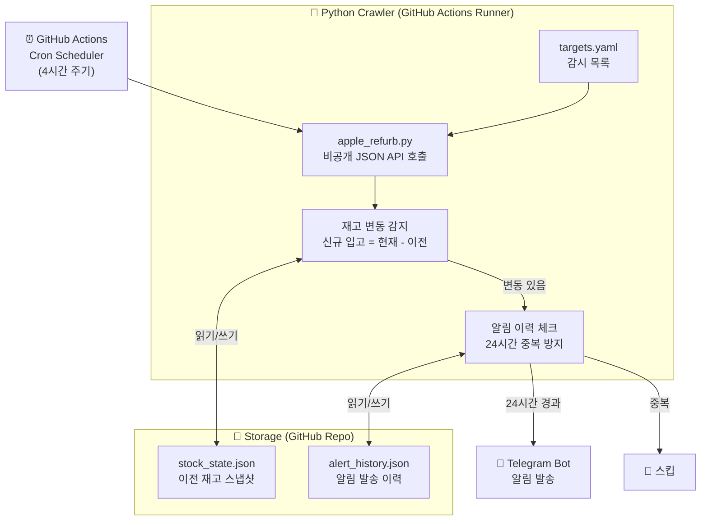
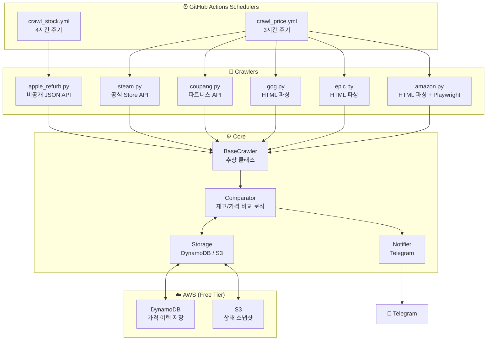
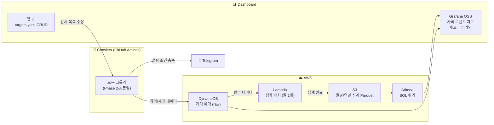
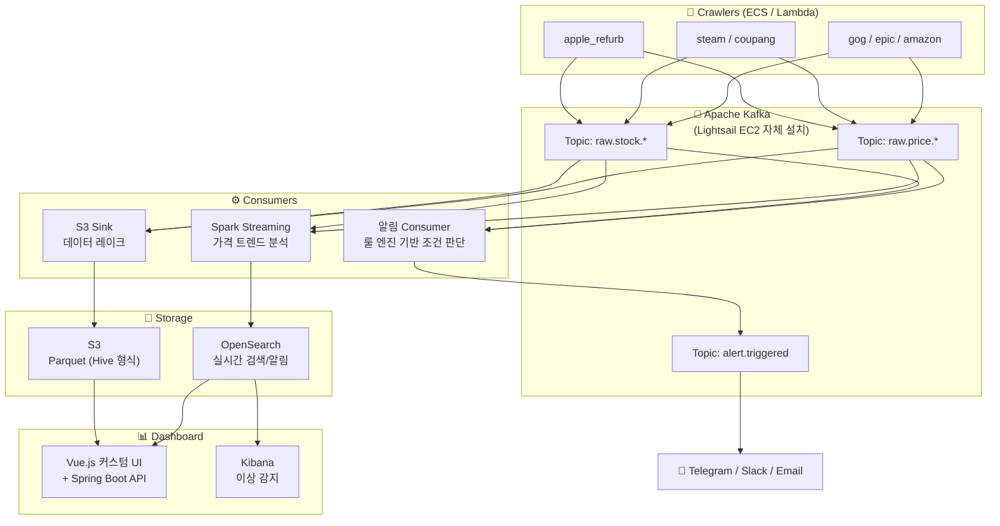

# DeReel — 시스템 아키텍처 설계서

> **버전:** v0.1.0
> **작성일:** 2026-03-31
> **작성자:** 한섭
> **연관 문서:** [PRD.md](./PRD.md) | [FEATURES.md](./FEATURES.md) | [NFR.md](./NFR.md)

---

## 1. 아키텍처 원칙

| 원칙 | 설명 |
|---|---|
| **비용 우선** | 각 Phase에서 무료 또는 최소 비용 인프라 선택 |
| **단계적 확장** | Phase 1은 최대한 단순하게, 필요 시 Phase 2/3으로 자연스럽게 이전 |
| **장애 격리** | 단일 크롤러 실패가 전체 시스템에 영향을 주지 않는 구조 |
| **플러그인 구조** | 새 크롤러 추가 시 기존 코드 수정 없이 파일 추가만으로 확장 |
| **설정 중심** | 모든 감시 조건은 코드가 아닌 `targets.yaml`로 관리 |

---

## 2. Phase별 아키텍처 진화

### Phase 1-A: MVP (현재 목표)



**핵심 특징**
- 서버 없음 — GitHub Actions Runner가 실행 환경
- 비용 $0 — 공개 repo 무제한 Actions 무료
- 상태 저장 — JSON 파일을 repo에 커밋하여 영속성 확보

---

### Phase 1-B ~ 2-A: 가격 감시 추가



**핵심 특징**
- `BaseCrawler` 추상 클래스로 모든 크롤러 인터페이스 통일
- 재고 크롤러(stock)와 가격 크롤러(price) 워크플로 분리
- AWS DynamoDB에 가격 이력 저장 시작

---

### Phase 2-B: 대시보드 추가



---

### Phase 3: Kafka 파이프라인 (미래)



---

## 3. 디렉토리 구조

```
dereel/
├── .github/
│   └── workflows/
│       ├── crawl_stock.yml         # 재고 크롤링 스케줄러 (4시간)
│       └── crawl_price.yml         # 가격 크롤링 스케줄러 (3시간)
│
├── config/
│   └── targets.yaml                # 감시 제품 목록 및 조건 설정
│
├── dereel/                         # 메인 패키지
│   ├── __init__.py
│   ├── run.py                      # 진입점 (--type stock|price)
│   │
│   ├── core/
│   │   ├── __init__.py
│   │   ├── base_crawler.py         # 추상 기반 클래스
│   │   ├── comparator.py           # 재고/가격 변동 감지 로직
│   │   ├── notifier.py             # Telegram 알림 발송
│   │   └── storage.py              # 상태 저장/불러오기 (JSON ↔ DynamoDB)
│   │
│   ├── crawlers/
│   │   ├── __init__.py
│   │   ├── apple_refurb.py         # [API] Apple 리퍼비시 재고
│   │   ├── steam.py                # [API] Steam 가격
│   │   ├── coupang.py              # [API] 쿠팡 파트너스 가격
│   │   ├── gog.py                  # [HTML] GOG 가격
│   │   ├── epic.py                 # [HTML] Epic Games 가격
│   │   └── amazon.py               # [HTML+Playwright] Amazon 가격
│   │
│   └── models/
│       ├── __init__.py
│       ├── stock_result.py         # 재고 결과 데이터 모델
│       └── price_result.py         # 가격 결과 데이터 모델
│
├── data/                           # Phase 1: 로컬 상태 저장소
│   ├── stock_state.json            # 이전 재고 스냅샷
│   └── alert_history.json          # 알림 발송 이력
│
├── tests/
│   ├── __init__.py
│   ├── test_comparator.py
│   ├── test_notifier.py
│   └── crawlers/
│       └── test_apple_refurb.py
│
├── docs/                           # 프로젝트 문서
│   ├── PRD.md
│   ├── FEATURES.md
│   ├── NFR.md
│   ├── ARCHITECTURE.md             # 이 문서
│   ├── CRAWLING_STRATEGY.md
│   ├── DATA_SCHEMA.md
│   ├── NOTIFICATION_SPEC.md
│   ├── DEV_SETUP.md
│   ├── CONVENTIONS.md
│   ├── HOW_TO_ADD_CRAWLER.md
│   ├── DEPLOYMENT.md
│   └── RUNBOOK.md
│
├── .env.example                    # 환경변수 템플릿 (실제 값 미포함)
├── .gitignore
├── pyproject.toml                  # 의존성 및 빌드 설정
├── requirements.txt
├── CHANGELOG.md
└── README.md
```

---

## 4. 핵심 컴포넌트 설계

### 4.1 BaseCrawler — 추상 기반 클래스

모든 크롤러는 `BaseCrawler`를 상속하여 아래 인터페이스를 구현한다.

```python
# dereel/core/base_crawler.py
from abc import ABC, abstractmethod
from typing import Any

class BaseCrawler(ABC):

    def __init__(self, config: dict):
        self.config = config            # targets.yaml 에서 주입된 설정값
        self.site_name: str = ""        # 하위 클래스에서 정의 (예: "apple_refurb")

    @abstractmethod
    def fetch(self) -> Any:
        """사이트에서 현재 데이터(재고/가격)를 가져온다."""

    @abstractmethod
    def parse(self, raw_data: Any) -> list[dict]:
        """API 응답 또는 HTML에서 정규화된 데이터 목록을 반환한다."""

    @abstractmethod
    def format_message(self, diff: dict) -> str:
        """Telegram 알림 메시지를 생성한다."""

    def run(self) -> None:
        """크롤링 → 파싱 → 비교 → 알림 전체 흐름 실행 (공통 로직)"""
        raw = self.fetch()
        current = self.parse(raw)
        comparator.compare_and_notify(self.site_name, current)
```

### 4.2 데이터 흐름 (Phase 1)

```
1. GitHub Actions Cron 트리거
        ↓
2. run.py 실행 (--type stock 또는 --type price)
        ↓
3. targets.yaml 로드 → enabled=true 크롤러 목록 추출
        ↓
4. 각 크롤러 BaseCrawler.run() 호출 (독립 try/except)
        ↓
5. fetch() → HTTP 요청 → 원본 데이터 수신
        ↓
6. parse() → 정규화된 데이터 (StockResult / PriceResult 리스트)
        ↓
7. comparator.compare() → 이전 상태(JSON)와 비교 → diff 생성
        ↓
8. storage.save() → 현재 상태를 JSON으로 저장
        ↓
9. diff가 있으면 → alert_history 확인 (24시간 중복 체크)
        ↓
10. 중복 아니면 → notifier.send() → Telegram 발송
         → alert_history 업데이트
```

### 4.3 Storage 전략 — Phase별 전환

| Phase | 저장소 | 저장 방식 | 비고 |
|---|---|---|---|
| 1-A | GitHub Repo | `data/*.json` 파일 커밋 | 단순, 무료, 이력 추적 가능 |
| 2-A | AWS DynamoDB | SDK boto3 | 가격 이력 장기 보관 시작 |
| 2-B | AWS S3 + Athena | Parquet 파일 | 집계 데이터 쿼리 최적화 |
| 3 | S3 + Kafka + OpenSearch | Streaming | 실시간 분석 |

`storage.py`는 추상 인터페이스를 제공하여 Phase 전환 시 크롤러 코드 변경 없이 저장소 구현체만 교체한다.

```python
# dereel/core/storage.py
class Storage(ABC):
    @abstractmethod
    def load_state(self, key: str) -> dict: ...

    @abstractmethod
    def save_state(self, key: str, data: dict) -> None: ...

    @abstractmethod
    def get_last_alert_time(self, alert_key: str) -> datetime | None: ...

    @abstractmethod
    def save_alert_time(self, alert_key: str, dt: datetime) -> None: ...

class JsonFileStorage(Storage):   # Phase 1
    ...

class DynamoDBStorage(Storage):   # Phase 2+
    ...
```

---

## 5. 인프라 구성

### Phase 1 인프라 (비용: $0/월)

| 컴포넌트 | 서비스 | 비용 |
|---|---|---|
| 코드 저장소 | GitHub (공개) | 무료 |
| 실행 환경 | GitHub Actions Runner | 무료 (공개 repo) |
| 상태 저장 | GitHub Repo JSON 파일 | 무료 |
| 알림 | Telegram Bot API | 무료 |
| 비밀 관리 | GitHub Secrets | 무료 |

### Phase 2 인프라 (비용: ~$5/월)

| 컴포넌트 | 서비스 | 비용 |
|---|---|---|
| 실행 환경 | GitHub Actions 또는 AWS Lambda | 무료 tier |
| 가격 이력 | AWS DynamoDB On-Demand | ~$0 (Free Tier: 25GB) |
| 집계 저장 | AWS S3 Standard | ~$0.023/GB |
| 쿼리 | AWS Athena | $5/TB 스캔 |
| 대시보드 | Grafana OSS (Lightsail $5/월) | ~$5/월 |

### Phase 3 인프라 (비용: ~$40-50/월)

| 컴포넌트 | 서비스 | 비용 |
|---|---|---|
| Kafka 브로커 ×2 | Lightsail 4GB ×2 | $40/월 |
| 데이터 레이크 | S3 + Glue | ~$5/월 |
| 대시보드 | Vue.js (Netlify 무료) | 무료 |
| 검색/분석 | OpenSearch (Lightsail) | $10/월~ |

---

## 6. 외부 의존성 및 API 요약

| 서비스 | 인증 방식 | Rate Limit | 비고 |
|---|---|---|---|
| Apple Refurb JSON | 없음 | 비공식, 보수적 운영 | 4시간 주기 |
| Steam Store API | 없음 | ~200 req/5min | 공식 API |
| 쿠팡 파트너스 API | HMAC Signature | 초당 5 req | 공식 API |
| GOG API | 없음 | 비공식, 보수적 운영 | 비공식 엔드포인트 |
| Epic Games | 없음 | 비공식 | HTML 파싱 |
| Amazon | 없음 | 비공식, 엄격한 봇 탐지 | Playwright 필요 |
| Telegram Bot | Bot Token | 30 msg/sec | python-telegram-bot |

---

## 7. 보안 아키텍처

```
GitHub Secrets
├── TELEGRAM_BOT_TOKEN
├── TELEGRAM_CHAT_ID
├── COUPANG_ACCESS_KEY
├── COUPANG_SECRET_KEY
├── AWS_ACCESS_KEY_ID       (Phase 2+)
└── AWS_SECRET_ACCESS_KEY   (Phase 2+)
         ↓ (환경변수로 주입)
GitHub Actions Runner
         ↓ (코드에서 os.environ으로 읽기)
Python 크롤러
```

- 모든 민감 정보는 코드에 직접 기재 금지
- `pydantic-settings`로 환경변수 타입 검증
- 로그 출력 시 토큰/키 마스킹 (`***` 처리)

---

## 8. 변경 이력

| 버전 | 날짜 | 내용 | 작성자 |
|---|---|---|---|
| v0.1.0 | 2026-03-31 | 최초 초안 작성 | 한섭 |

