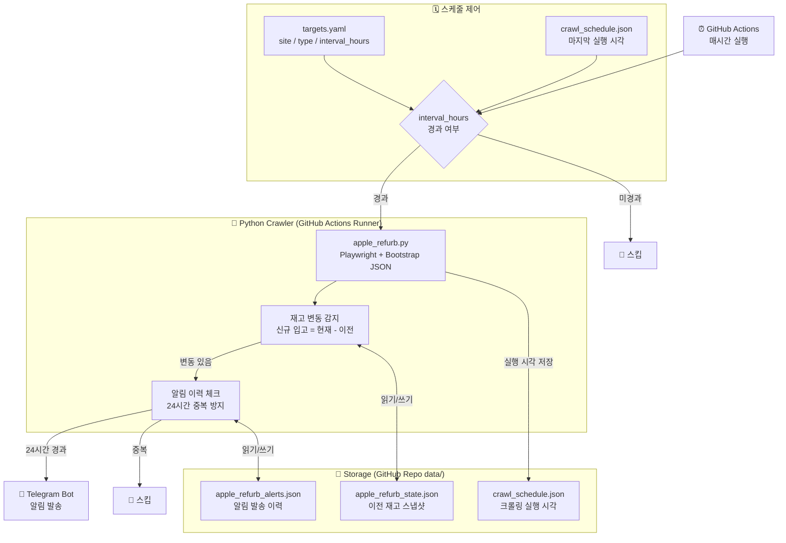
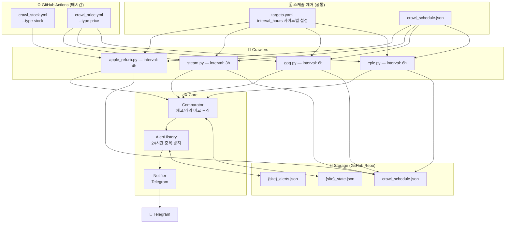
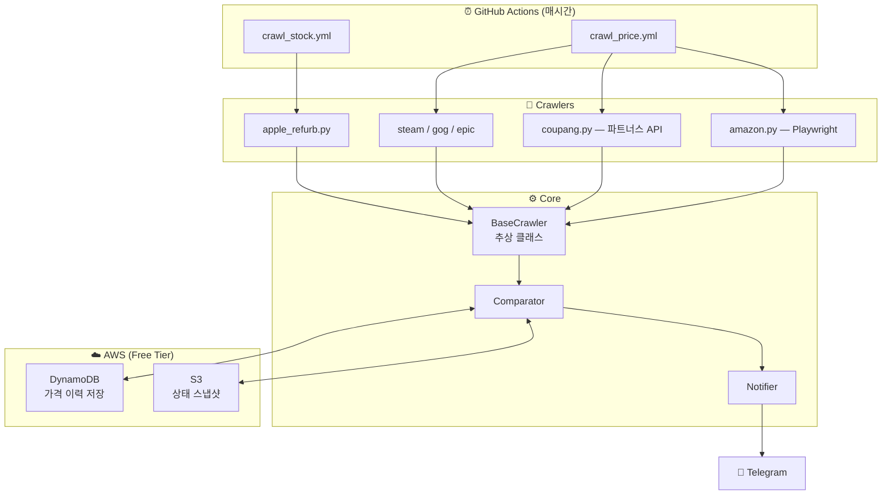
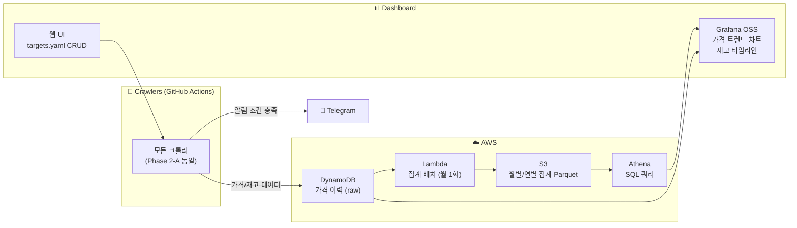

# DeReel — 시스템 아키텍처 설계서

> **버전:** v0.2.0
> **작성일:** 2026-05-05
> **작성자:** 한섭
> **연관 문서:** [PRD.md](./PRD.md) | [FEATURES.md](./FEATURES.md) | [NFR.md](./NFR.md)

---

## 1. 아키텍처 원칙

| 원칙 | 설명 |
|---|---|
| **비용 우선** | 각 Phase에서 무료 또는 최소 비용 인프라 선택 |
| **단계적 확장** | Phase 1은 최대한 단순하게, 필요 시 Phase 2/3으로 자연스럽게 이전 |
| **장애 격리** | 단일 크롤러 실패가 전체 시스템에 영향을 주지 않는 구조 |
| **플러그인 구조** | 새 크롤러 추가 시 기존 코드 수정 없이 파일 추가만으로 확장 |
| **설정 중심** | 모든 감시 조건은 코드가 아닌 `targets.yaml`로 관리 |

---

## 2. Phase별 아키텍처 진화

### Phase 1-A: MVP ✅



**핵심 특징**
- 서버 없음 — GitHub Actions Runner가 실행 환경
- 비용 $0 — 공개 repo 무제한 Actions 무료
- 상태 저장 — JSON 파일을 repo에 커밋하여 영속성 확보
- 사이트별 스케줄 — `interval_hours`로 사이트마다 크롤링 주기 독립 제어

---

### Phase 1-B: 가격 감시 추가



---

### Phase 2-A: AWS 도입



---

### Phase 2-B: 대시보드 추가



---

### Phase 3: Kafka 파이프라인 (미래)


---

## 3. 디렉토리 구조

```
dereel/
├── .github/
│   └── workflows/
│       ├── crawl_stock.yml       재고 크롤러 워크플로 (매시간)
│       └── crawl_price.yml       가격 크롤러 워크플로 (매시간)
├── config/
│   └── targets.yaml              감시 대상 / 크롤링 주기 설정
├── dereel/
│   ├── core/
│   │   ├── alert_history.py      24시간 중복 알림 방지
│   │   ├── base_crawler.py       크롤러 추상 기반 클래스
│   │   ├── comparator.py         재고/가격 변동 감지
│   │   ├── notifier.py           Telegram 알림 발송
│   │   ├── settings.py           환경변수 관리 (pydantic-settings)
│   │   └── storage.py            JSON 파일 기반 상태 저장
│   ├── crawlers/
│   │   └── apple_refurb.py       Apple 리퍼비시 크롤러
│   ├── models/
│   │   └── stock_result.py       재고 결과 데이터 모델
│   └── run.py                    엔트리포인트 (--type stock|price)
├── data/                         상태 파일 (GHA가 자동 커밋)
│   ├── {site}_state.json         재고/가격 스냅샷
│   ├── {site}_alerts.json        알림 발송 이력
│   └── crawl_schedule.json       마지막 크롤링 실행 시각
├── docs/                         설계 문서
└── tests/                        단위 테스트
```

---

## 4. 핵심 모듈 관계

```
run.py
  │  --type stock|price
  │  targets.yaml 로드
  │  interval_hours 스케줄 체크
  │
  ├── Crawler (site별)
  │     └── BaseCrawler
  │           fetch(url) → List[StockResult]
  │
  ├── Comparator
  │     compare_stock(site, results)
  │       └── Storage.load_state / save_state
  │       └── AlertHistory.can_alert
  │             └── Storage.get_last_alert_time / save_alert_time
  │       └── Notifier.send(message)
  │
  └── Storage
        ├── {site}_state.json       재고 스냅샷
        ├── {site}_alerts.json      알림 이력
        └── crawl_schedule.json     스케줄 이력
```

---

## 5. 데이터 흐름

```
1. GHA cron 매시간 실행
2. run.py --type stock
3. targets.yaml에서 type=stock + enabled=true 필터링
4. 각 target의 interval_hours 경과 여부 확인
   → 미경과: 스킵
   → 경과: 크롤링 실행
5. crawler.fetch(url) → List[StockResult]
6. comparator.compare_stock()
   a. storage.load_state()로 이전 스냅샷 로드
   b. 신규 입고 = 현재 목록 - 이전 목록
   c. 신규 입고 있으면 alert_history.can_alert() 확인
   d. 알림 가능하면 notifier.send()
   e. storage.save_state()로 현재 스냅샷 저장
7. storage.save_crawled_at()으로 실행 시각 저장
8. GHA가 data/ 변경사항 자동 커밋
```

## 6. 아키텍처 보완 설계 (Phase 1 피드백 반영)

### 6.1 Storage 추상화 계층 (Interface) 도입
Phase 1(JSON 파일)에서 Phase 2(DynamoDB / S3)로 전환될 때 핵심 모듈(`Comparator`, `run.py`)의 비즈니스 로직을 변경하지 않고 저장소 엔진만 교체할 수 있도록 공통 `StorageInterface` 추상 클래스를 설계한다.

```python
# dereel/core/base_storage.py
from abc import ABC, abstractmethod

class BaseStorage(ABC):
    @abstractmethod
    def load_state(self, site: str) -> dict: ...
    @abstractmethod
    def save_state(self, site: str, state: dict) -> None: ...
    @abstractmethod
    def load_alert_history(self) -> dict: ...
    @abstractmethod
    def save_alert_history(self, history: dict) -> None: ...
```

* **Phase 1:** `BaseStorage`를 상속받은 `JSONFileStorage` 구현 (`data/` 디렉토리 파일 I/O 및 GHA 커밋 연동)
* **Phase 2:** `BaseStorage`를 상속받은 `DynamoDBStorage` 구현 (`boto3` 라이브러리로 AWS 리소스 I/O)
* **설정 주입:** 환경변수 `DEREEL_STORAGE_TYPE` (값: `json` | `dynamodb`)에 따라 팩토리 패턴을 통해 동적 주입

### 6.2 Phase 1 연속 장애 감지 (Consecutive Failures Count)
NFR 규격의 "연속 3회 크롤링 실패 시 알림" 조건을 별도의 외부 인프라(CloudWatch)가 없는 Phase 1 상태에서도 지원하기 위해, `data/crawl_schedule.json` 스키마 내에 사이트별 연속 장애 카운트(`consecutive_failures`)를 기록하고 추적한다.

```json
// data/crawl_schedule.json
{
  "schedules": {
    "apple_refurb:https://...": 1746380940.603
  },
  "failures": {
    "apple_refurb": {
      "consecutive_failures": 3,
      "last_error_message": "HTTP 502 Bad Gateway"
    }
  }
}
```
* 크롤러 성공 시 `consecutive_failures`를 0으로 리셋한다.
* 크롤러 실패 시 값을 1씩 누적 증가시키며, 값이 **3**에 도달하는 순간 즉시 Telegram으로 `error` 유형 경보를 발송하여 개발자에게 비상 장애 상황을 전파한다.

---

## 7. 변경 이력

| 버전 | 날짜 | 내용 | 작성자 |
|---|---|---|---|
| v0.1.0 | 2026-03-31 | 최초 초안 작성 | 한섭 |
| v0.2.0 | 2026-05-05 | interval_hours 스케줄 구조 반영, Storage 파일 구조 업데이트, Phase 1-B 아키텍처 추가 | 한섭 |
| v0.3.0 | 2026-05-26 | Storage 추상화 설계, 연속 에러 추적 구조, Git 동시 실행 동기화 등 보완 사양 반영 | 한섭 |
